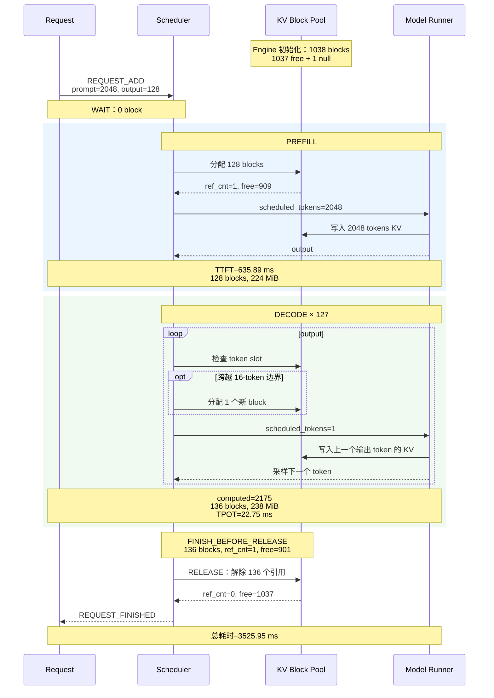

# Topic 1：单请求中的 KV 生命周期

## 1. 目标与结论

目标是建立单请求下 KV Cache 的基础动态直觉：KV 何时生成、如何增长、在请求期间如何被持有，以及请求结束后如何变化。

本 Topic 已在以下基础范围内完成：

- 模型：Qwen3-1.7B
- Prompt：128 / 512 / 2048 tokens
- Output：1 / 32 / 128 tokens
- 并发：1
- block size：16 tokens
- 关闭 prefix caching、chunked prefill、异步调度等复杂机制
- 复用同一个 Engine 完成 9 组实验；并发 1 表示一次只调度一个请求，不表示每个请求重新初始化 Engine

最终结论：Engine 初始化时预分配物理 KV Cache 池；请求在 Prefill 前取得 block，Prefill 执行时写入 Prompt KV；Decode 每步通常新增一个逻辑 KV token，只有跨越 block 边界时才增加物理 block；请求结束前历史 block 始终由请求持有；结束后解除引用并归还空闲池，而不是销毁 KV Cache 池。

## 2. 实验参数与含义

实验需要控制的核心参数：

- `prompt_tokens`：输入 token 数，通过构造指定长度的 `prompt_token_ids` 精确控制。
- `max_tokens`：最多生成的输出 token 数，本实验分别为 1、32、128。
- `max_model_len=4096`：允许的最大上下文长度，需覆盖 `prompt + output`。
- `max_num_seqs=1`：每次最多调度一个请求。
- `max_num_batched_tokens=4096`：允许一次 Prefill 调度完整的 2048-token Prompt。
- `block_size=16`：每个物理 KV block 容纳 16 个 token slot。
- `enable_prefix_caching=False`：排除跨请求 KV 复用。
- `enable_chunked_prefill=False`：避免 Prefill 被拆成多个调度 step。
- `async_scheduling=False`：使用常规同步调度。
- `enforce_eager=True`：减少图捕获等机制对基础观察的干扰。

本次只修改 Python 代码，因此不需要重新编译 C++/CUDA；重新启动 Engine/进程即可加载新日志代码。

## 3. 日志设计与实现

日志以 Engine 为中心，采用结构化 JSONL，并分为两份：

### 3.1 核心日志

用于快速理解生命周期，主要记录：

- `request_id`
- Prompt / Output token 数
- `phase`：wait、prefill、decode、finish、release
- scheduler step
- 本 step 的 `scheduled_tokens`
- `num_computed_tokens`
- 请求持有的 block 数
- free block 数
- 时间戳和相对耗时
- TTFT、TPOT、总耗时

### 3.2 详细日志

用于精细验证，额外记录：

- 完整 allocated block IDs
- 每个 block 的 `ref_cnt`
- Finish 前的 block 状态
- Release 后的 block 状态
- block 归还前后 free block 数

### 3.3 事件时间线

```text
REQUEST_ADD
    → SCHEDULE(PREFILL)
    → STEP_OUTPUT(first token)
    → SCHEDULE/STEP_OUTPUT(DECODE) × N
    → FINISH_BEFORE_RELEASE
    → RELEASE_AFTER
```

相关实现：

- `vllm/v1/core/kv_lifecycle.py`：结构化生命周期 tracer
- `vllm/envs.py`：`VLLM_KV_LIFECYCLE_TRACE_DIR` 开关
- `vllm/v1/core/sched/scheduler.py`：add、schedule、step output、finish、release 埋点
- `examples/basic/offline_inference/kv_lifecycle.py`：9 组实验入口
- `tests/v1/core/test_scheduler.py`：事件顺序、字段、引用计数和 free block 恢复测试

当前日志精确观察 scheduler 的 block 分配、token 进度和引用状态；它不是逐层 CUDA kernel 写 KV 的纳秒级追踪，但足够覆盖 Topic 1 的目标。

## 4. KV Cache 基础配置

Qwen3-1.7B 本次实际使用 FP16，模型相关参数为：

- Transformer layers：28
- Attention heads：16
- KV heads：8
- Head dimension：128
- 每 token、所有层合计 KV：112 KiB
- 每 block、每层：64 KiB
- 每 block、所有层合计：1.75 MiB
- GPU KV blocks：1038，其中 1 个为 null block，可用 free blocks 为 1037
- KV token capacity：16608 tokens
- KV Cache 池约 1.774 GiB

理论计算：

```text
每 token KV bytes
= 2(K和V) × 28层 × 8个KV heads × 128 head_dim × 2 bytes(FP16)
= 114688 bytes
= 112 KiB

每 block KV bytes
= 16 tokens × 112 KiB
= 1.75 MiB
```

## 5. 九组实验结果

| Prompt | Output | 最终 computed tokens | 峰值 blocks | TTFT (ms) | TPOT (ms) | 总耗时 (ms) |
| ---: | ---: | ---: | ---: | ---: | ---: | ---: |
| 128 | 1 | 128 | 8 | 23.88 | — | 24.09 |
| 128 | 32 | 159 | 10 | 28.46 | 23.04 | 742.90 |
| 128 | 128 | 255 | 16 | 22.28 | 22.36 | 2861.87 |
| 512 | 1 | 512 | 32 | 77.54 | — | 77.76 |
| 512 | 32 | 543 | 34 | 81.57 | 24.17 | 831.16 |
| 512 | 128 | 639 | 40 | 77.44 | 22.50 | 2935.25 |
| 2048 | 1 | 2048 | 128 | 644.55 | — | 644.83 |
| 2048 | 32 | 2079 | 130 | 672.76 | 23.86 | 1412.63 |
| 2048 | 128 | 2175 | 136 | 635.89 | 22.75 | 3525.95 |

所有组合均满足：

```text
finish num_computed_tokens = prompt + output - 1
peak blocks = ceil(num_computed_tokens / 16)
Finish 前所有请求 block ref_cnt = 1
Release 后所有请求 block ref_cnt = 0
Release 后 free blocks 恢复到实验前水平
```

## 6. 五个核心问题

### 6.1 Prefill 在什么时候生成 KV？

Scheduler 在执行 Prefill 前分配 Prompt 所需的物理 block；模型执行 Prefill forward 时逐层计算并将 Prompt 的 K/V 写入这些 block。首个 `STEP_OUTPUT` 表示 Prefill 已完成，并同时得到第一个输出 token。

以 Prompt=2048 为例，Prefill 前分配 `ceil(2048/16)=128` 个 block；Prefill 完成时 `num_computed_tokens=2048`、请求持有 128 个 block。

### 6.2 Decode 每生成一个 token，KV 如何增长？

每个 Decode step 将上一个生成 token 作为模型输入，计算并写入它的 KV，然后采样下一个 token。因此通常每步：

```text
num_computed_tokens += 1
逻辑 KV token 数 += 1
```

物理 block 不会每步增加。当前 block 未满时继续写入；跨越 16-token 边界时才分配一个新 block。

### 6.3 连续 Decode 时，历史 KV 是否始终被请求持有？

在本次基础配置下，是。Prefill 和所有 Decode step 产生的历史 KV block 始终保留在请求 block table 中，直到请求结束，`ref_cnt` 始终为 1。Decode 需要读取完整历史上下文，因此不会逐步释放旧 KV。

该结论限定于未启用抢占、swap、prefix caching、滑动窗口等机制的当前实验。

### 6.4 请求结束后，KV 是立即删除，还是仅解除请求引用？

请求结束后解除引用并归还 block，不销毁 Engine 的物理 KV Cache 池：

```text
Finish 前：请求持有 block，ref_cnt=1
Release 后：请求不再持有 block，ref_cnt=0，block 返回 free queue
```

显存中的旧数值可能暂时存在，但已经不再属于该请求，之后会被新请求覆盖。

### 6.5 Prompt 和 Output 长度如何影响 KV 占用？

Prompt 决定 Prefill 后的基础占用；Output 决定 Decode 期间的增量：

```text
Prefill blocks = ceil(prompt / block_size)
最终 KV tokens = prompt + output - 1
峰值 blocks = ceil((prompt + output - 1) / block_size)
实际物理占用 = 峰值 blocks × 每 block bytes
```

最后一个输出 token 只被采样出来，没有再次作为模型输入，因此没有对应 KV，最终是 `prompt + output - 1`。

## 7. Prompt=2048、Output=128 详细 Trace

内部 request ID：`8-bcdcf793`。所有时间相对 `REQUEST_ADD`：

| 时间 (ms) | 阶段/事件 | computed tokens | output tokens | blocks | KV 分配 | free blocks |
| ---: | --- | ---: | ---: | ---: | ---: | ---: |
| 0.000 | Request Add | 0 | 0 | 0 | 0 | 1037 |
| 0.054 | Prefill 开始 | 0 | 0 | 128 | 224 MiB | 909 |
| 635.889 | Prefill 完成 / output #1 | 2048 | 1 | 128 | 224 MiB | 909 |
| 685.413 | Decode / output #2 | 2049 | 2 | 129 | 225.75 MiB | 908 |
| 1051.235 | Decode / output #18 | 2065 | 18 | 130 | 227.50 MiB | 907 |
| 1421.944 | Decode / output #34 | 2081 | 34 | 131 | 229.25 MiB | 906 |
| 1773.198 | Decode / output #50 | 2097 | 50 | 132 | 231.00 MiB | 905 |
| 2120.369 | Decode / output #66 | 2113 | 66 | 133 | 232.75 MiB | 904 |
| 2489.837 | Decode / output #82 | 2129 | 82 | 134 | 234.50 MiB | 903 |
| 2858.832 | Decode / output #98 | 2145 | 98 | 135 | 236.25 MiB | 902 |
| 3220.400 | Decode / output #114 | 2161 | 114 | 136 | 238.00 MiB | 901 |
| 3525.724 | Decode / output #128 | 2175 | 128 | 136 | 238.00 MiB | 901 |
| 3525.857 | Finish Before Release | 2175 | 128 | 136 | 238.00 MiB | 901 |
| 3525.953 | Release After | — | 128 | 0 | 0 | 1037 |

关键时间指标：

- Wait：约 0.054 ms
- Prefill / TTFT：约 635.89 ms
- TPOT：约 22.75 ms/token
- 总耗时：约 3525.95 ms
- Finish 到 Release：约 0.096 ms

Finish 前 136 个 block 的 `ref_cnt` 全为 1；Release 后全为 0，free blocks 从 901 恢复到 1037。

### 实际占用与理论占用

```text
有效 KV = 2175 × 112 KiB = 237.890625 MiB
物理分配 = 136 × 1.75 MiB = 238 MiB
内部碎片 = 0.109375 MiB = 112 KiB
```

136 个 block 提供 `136×16=2176` 个 token slot，实际使用 2175 个，因此最后一个 block 剩余一个 token slot。

## 8. 单请求 KV 生命周期时序图



图从上向下表示事件顺序，纵向距离不代表真实耗时比例；真实时间以详细 Trace 表中的相对时间为准。

## 9. 逻辑 block、物理 block 与连续性

- 逻辑 token：请求上下文中的 token 顺序，始终连续。
- 物理 token slot：物理 KV block 中可写入一个 token KV 的位置。
- 逻辑 block：按每 16 个逻辑 token 划分的页，顺序连续。
- 物理 block：KV Cache 池中的固定大小页，通过 block table 映射到逻辑 block。

本轮 136 个物理 block ID 恰好是 399 到 534，ID 连续；这是单请求、关闭 prefix caching 且空闲队列状态简单时的分配结果，不是 vLLM 的保证。vLLM 从 free queue 取 block，并不要求物理 block ID 连续。在并发请求、抢占、不同释放顺序或 prefix caching 下，逻辑 block 可以映射到离散物理 ID。

物理不连续不影响正确性，也不需要先复制或拼接 KV；attention kernel 通过 block table 寻址。连续 block 可能改善 L2 Cache、TLB 和访问局部性，但 PagedAttention 本身就是为离散页设计的，Decode 的主要成本通常仍是历史 KV 总读取量、上下文长度、显存带宽和 kernel 实现。本实验只有连续 ID 情况，不能据此量化连续与离散对 TPOT 的差异。

## 10. 验收与产物

已完成的验证：

- 9 组 Qwen3-1.7B 实验全部完成
- 生命周期事件顺序正确
- `num_computed_tokens`、block 数公式全部成立
- Finish / Release 前后 `ref_cnt` 正确
- Release 后 free block 数恢复
- scheduler 相关测试通过：4 passed
- Ruff check、format 和 Python 3.12 mypy 通过

原始产物：

- 核心日志：`output/kv_lifecycle_qwen3_1_7b/kv_lifecycle_core_451194_1785602841776298424.jsonl`
- 详细日志：`output/kv_lifecycle_qwen3_1_7b/kv_lifecycle_detail_451194_1785602841776298424.jsonl`
- 汇总结果：`output/kv_lifecycle_qwen3_1_7b/` 下的 results JSON

## 11. Topic 1 最终认识

```text
Engine 初始化
→ 创建固定大小的物理 KV Cache 池
→ 请求加入 Scheduler
→ Prefill 前取得 Prompt 所需 block
→ Prefill 计算并写入 Prompt KV
→ Decode 每步增加一个逻辑 KV token
→ 每跨越 16-token 边界增加一个物理 block
→ 历史 KV 在请求存活期间始终被持有
→ Finish 前 block 的 ref_cnt 仍为 1
→ Release 后 ref_cnt 变为 0
→ block 返回 free queue，供后续请求复用
```

至此，Topic 1 的实验、结构化 Trace、详细案例、时序图以及核心问题均已完成。
