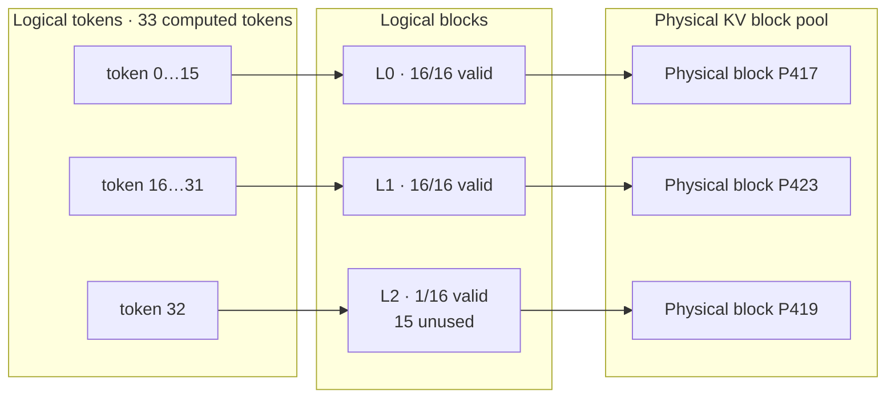

# Topic 2：Block 与 Paged KV 管理

## 1. 目标与范围

本 Topic 研究 vLLM 如何把连续的请求 token 序列划分成固定大小的逻辑页，
再通过 Block Table 映射到 KV Cache 池中的物理页；重点是边界、内部碎片、
不连续物理映射，以及 Continuous Batching 中的动态分配与回收。

基础实验固定：

- 模型：Qwen3-1.7B，实际 KV dtype 为 FP16
- GPU：RTX 2080
- block size：16 tokens
- prefix caching：关闭
- chunked prefill：关闭
- speculative decoding：关闭
- async scheduling：关闭
- max model length：4096
- 并发：1 / 4 / 8

Block Size 性能对照和 Prefix Cache 共享语义不属于本轮基础任务。

## 2. 实现与日志

Topic 1 的生命周期 tracer 扩展了以下字段：

- logical block index 到 physical block ID 的逐项映射
- 每个 Block 的有效 token 数和未使用 token slots
- 每次 `allocate_slots` 的耗时和分配前后 Free Queue 长度
- Block free 耗时和释放前后 Free Queue 长度
- `num_preemptions` 和是否发生 recompute

实验入口分为三部分：

1. Prompt 边界：15/16/17、31/32/33、255/256/257、
   511/512/513、2047/2048/2049，Output=1。
2. Decode 边界：Prompt=16/32/256，Output=2/17/18。
3. Continuous Batching：混合长度映射实验，以及相同
   Prompt=512、Output=128 的并发 1/4/8 伸缩实验。

本轮共运行 50 个真实请求。Engine 创建了 678 个物理 Block，其中 677 个
初始可分配，另一个为 null block；总容量为 10848 token slots。

## 3. Token、Logical Block 与 Physical Block

对于已经写入 KV 的 token 数 `C` 和 `block_size=16`：

```text
logical_blocks = ceil(C / 16)
logical_block_index = logical_token_index // 16
offset_in_block = logical_token_index % 16
unused_slots = logical_blocks * 16 - C
```

Logical Block 描述请求中的连续逻辑位置；Physical Block 是 KV Cache 池中的
实际内存页。Block Table 保存二者之间的映射，因此逻辑顺序不要求物理 ID
连续。



图中的 Physical ID 用于表达允许离散映射，不是特定请求的实际 ID。

## 4. Prompt Block 边界结果

| Prompt | Logical Blocks | 最后 Block 有效 tokens | 未使用 slots |
| ---: | ---: | ---: | ---: |
| 15 | 1 | 15 | 1 |
| 16 | 1 | 16 | 0 |
| 17 | 2 | 1 | 15 |
| 31 | 2 | 15 | 1 |
| 32 | 2 | 16 | 0 |
| 33 | 3 | 1 | 15 |
| 255 | 16 | 15 | 1 |
| 256 | 16 | 16 | 0 |
| 257 | 17 | 1 | 15 |
| 511 | 32 | 15 | 1 |
| 512 | 32 | 16 | 0 |
| 513 | 33 | 1 | 15 |
| 2047 | 128 | 15 | 1 |
| 2048 | 128 | 16 | 0 |
| 2049 | 129 | 1 | 15 |

跨越边界时不会扩展已有物理页，而是给新的 Logical Block 分配另一个
Physical Block。最后一个 Block 即使只有一个有效 token，也以完整物理页存在；
剩余 slots 是内部碎片，仍属于该请求，不能分给另一个普通请求使用。

## 5. Output 与 Decode 跨边界

最终已经写入 KV 的 token 数为：

```text
computed = prompt + output - 1
```

以 Prompt=16 为例：

| Output | Computed | Blocks | 含义 |
| ---: | ---: | ---: | --- |
| 1 | 16 | 1 | Prompt 恰好填满一页 |
| 2 | 17 | 2 | 第一次 Decode 立即申请新页 |
| 17 | 32 | 2 | 新页恰好填满 |
| 18 | 33 | 3 | 再次跨过边界 |

Decode 每一步通常只增加一个逻辑 KV token；只有当前页没有空余 slot 时，
物理 Block 数才增加。因此逻辑占用线性增长，物理占用呈阶梯增长。

## 6. 物理 Block 可以不连续

可以。本轮 50 个请求中有 26 个请求的 Logical Blocks 映射到了不连续的
Physical Block IDs。

例如 Prompt=2049、Output=128 的请求 `24-b785fc04` 最终持有 136 个 Block。
物理 ID 的一部分为：

```text
612, 613, ..., 676, 677, 1, 2, 4, 3, 6, 5, 8, 7, 11, ...
```

Logical Block index 仍然是连续的 `0…135`。Block Table 将每个逻辑页映射到
对应物理页，Attention 根据映射寻址，不要求先把物理 KV 搬成连续内存。

这也说明 Topic 1 中观察到的连续 Physical IDs 只是当时 Free Queue 状态简单
造成的结果，不是 vLLM 的分配保证。

## 7. Continuous Batching 中的动态管理

一个 Scheduler step 可以同时包含多个请求。每个请求分别执行：

```text
检查本 step 需要的 KV slots
→ 当前页有空间：继续写入
→ 跨页：从 Free Queue 取得新 Physical Block
→ 更新请求 Block Table
```

请求完成时：

```text
Finish 前保持完整 Block Table，ref_cnt=1
→ 解除全部请求引用
→ ref_cnt=0
→ Block 返回 Free Queue
→ 后续请求可以按 Free Queue 顺序复用这些页
```

关闭 Prefix Cache 后，同一时刻活动的不同请求没有共享 Physical Block ID。
本轮所有批次最后一个请求释放后，Free Queue 均恢复到初始的 677。

## 8. 并发吞吐与延迟

相同 workload：每个请求 Prompt=512、Output=128。

| 并发 | Batch 耗时 | Output 吞吐 | Total token 吞吐 | 最大请求延迟 |
| ---: | ---: | ---: | ---: | ---: |
| 1 | 2.896 s | 44.20 tok/s | 221.00 tok/s | 2894.84 ms |
| 4 | 3.344 s | 153.11 tok/s | 765.55 tok/s | 3342.43 ms |
| 8 | 3.899 s | 262.64 tok/s | 1313.19 tok/s | 3871.19 ms |

并发提高后，总吞吐明显增加，但每个请求共享 GPU 执行资源，最大请求延迟也随之
增加。数据包含 eager 模式和结构化 Trace 开销，用于解释调度与相对比较，不代表
无日志生产性能。

## 9. Block 管理耗时与抢占

| 操作 | Mean | P95 | Max |
| --- | ---: | ---: | ---: |
| `allocate_slots` | 0.0107 ms | 0.0219 ms | 0.1701 ms |
| free | 0.0185 ms | 0.0530 ms | 0.2752 ms |

这些是 CPU Scheduler/Block Manager 路径的测量，不是 GPU 写入 KV 的耗时。

本轮 KV 容量足够：

```text
preemption = false
recompute = false
```

因此基础结果描述的是正常 Continuous Batching，而不是显存压力下的恢复路径。

## 10. 为什么使用固定大小 Block

固定大小页让 vLLM 可以：

- 不要求为整个请求寻找一段连续物理 KV 内存。
- 随请求增长按页分配，而不是搬迁已有 KV。
- 请求结束后按页快速回收和复用。
- 在 Continuous Batching 中独立管理不同长度、不同结束时间的请求。
- 将难以管理的外部碎片转化为有上界的页内碎片。

代价是最后一页最多浪费 `block_size-1` 个 slots，并需要维护 Block Table。

## 11. 验收与产物

自动验收覆盖 50 个请求并全部通过：

- `logical_blocks = ceil(computed / 16)`
- Logical Block index 连续
- 映射数量与 Logical Block 数一致
- 有效 tokens 与内部空槽公式正确
- 活动请求之间不共享物理页
- Finish 前后引用和 Free Queue 正确
- 所有批次结束后 Free Queue 恢复
- 未发生 preemption/recompute

产物：

- `examples/basic/offline_inference/paged_kv_blocks.py`：实验入口
- `examples/basic/offline_inference/analyze_paged_kv_blocks.py`：离线验收
- `output/paged_kv_blocks_qwen3_1_7b_final/experiment_results.json`
- `output/paged_kv_blocks_qwen3_1_7b_final/analysis_summary.json`
- `output/paged_kv_blocks_qwen3_1_7b_final/kv_lifecycle_core_*.jsonl`
- `output/paged_kv_blocks_qwen3_1_7b_final/kv_lifecycle_detail_*.jsonl`

最终认识：请求的 token 顺序属于逻辑空间；KV Cache 池属于物理空间；固定大小
Block 和 Block Table 将两者解耦，使请求能够按需增长、使用离散物理页，并在
Continuous Batching 中独立释放和复用内存。
