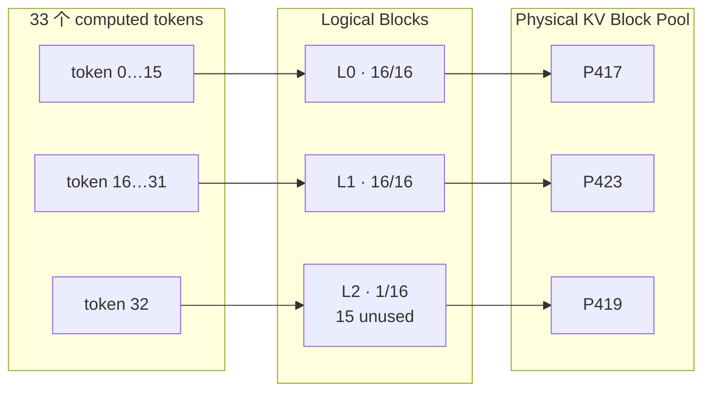

# Topic 2：Block 与 Paged KV 管理总结

## 1. 本 Topic 回答什么

本 Topic 的目标是建立 vLLM KV Cache 的分页心智模型：请求看到的是连续 token，
运行时管理的是固定大小的 Logical Block，而真正的 KV 数据位于可离散分配的
Physical Block 中。Block Table 将逻辑顺序与物理位置解耦。

本文只保留实验设计、Trace 证据和已验证结论。逐项机制问答见
[`TOPIC_2_FAQ.md`](TOPIC_2_FAQ.md)，由实验延伸出的研究设想见
[`TOPIC_2_THINKING.md`](TOPIC_2_THINKING.md)。

原始问题包括：

1. 为什么 KV 要切成固定大小的 Block？
2. Token、Logical Block、Physical Block 如何对应？
3. Prompt 跨越 Block 边界时发生什么？
4. 最后一个未填满 Block 如何处理？
5. 一个或多个请求能否使用不连续的 Physical Block？
6. Continuous Batching 中 Block 如何动态分配和回收？

## 2. 实验范围与实现

基础配置：

| 项目 | 配置 |
| --- | --- |
| 模型 | Qwen3-1.7B |
| GPU | RTX 2080 |
| KV dtype | FP16 |
| Block size | 16 tokens |
| Prefix Cache | 关闭 |
| Chunked Prefill | 基础实验关闭；延迟干扰实验同时测试开/关 |
| Speculative Decoding | 关闭 |
| Async Scheduling | 关闭 |
| Max Model Length | 4096 |
| 并发 | 1 / 4 / 8 |

Tracer 在 Topic 1 生命周期信息之上增加了：

- Logical Block index → Physical Block ID 映射；
- 每个 Block 的有效 token 数与未使用 slots；
- `allocate_slots`、free 的耗时；
- 分配、释放前后的 Free Queue 长度；
- Block `ref_cnt`；
- Scheduler step 内每个请求的 phase 与 scheduled tokens；
- preemption 和 recompute 状态。

基础实验共运行 50 个真实请求：

- Prompt 边界：15/16/17、31/32/33，以及 255/256/257、
  511/512/513、2047/2048/2049；
- Decode 边界：Prompt=16/32/256，Output=2/17/18；
- 并发映射：不同长度请求并发 1/4/8；
- 并发伸缩：固定 Prompt=512、Output=128，并发 1/4/8。

Engine 创建了 678 个 Physical Block，其中 1 个是 null block，677 个进入可分配
池，总容量为 `677 × 16 = 10832` 个普通 token slots。

## 3. 核心映射

令已经真正计算并写入 KV 的 token 数为 `C`，`block_size=16`：

```text
logical_blocks          = ceil(C / 16)
logical_block_index     = logical_token_index // 16
offset_in_block         = logical_token_index % 16
last_block_valid_tokens = ((C - 1) % 16) + 1       # C > 0
unused_slots            = logical_blocks * 16 - C
```

三个概念分别回答不同问题：

| 概念 | 回答的问题 |
| --- | --- |
| Token | 请求逻辑序列中的第几个位置？ |
| Logical Block | 这个位置属于请求的哪一页？ |
| Physical Block | 这一页的 KV 实际存在哪个内存页？ |



图中的物理 ID 用来说明映射允许离散，不是某个实验请求的固定 ID。

## 4. Prompt 跨越 Block 边界

边界结果严格符合向上取整：

| Prompt tokens | Logical Blocks | 最后一页有效 tokens | 未使用 slots |
| ---: | ---: | ---: | ---: |
| 15 | 1 | 15 | 1 |
| 16 | 1 | 16 | 0 |
| 17 | 2 | 1 | 15 |
| 31 | 2 | 15 | 1 |
| 32 | 2 | 16 | 0 |
| 33 | 3 | 1 | 15 |
| 255 | 16 | 15 | 1 |
| 256 | 16 | 16 | 0 |
| 257 | 17 | 1 | 15 |
| 511 | 32 | 15 | 1 |
| 512 | 32 | 16 | 0 |
| 513 | 33 | 1 | 15 |
| 2047 | 128 | 15 | 1 |
| 2048 | 128 | 16 | 0 |
| 2049 | 129 | 1 | 15 |

从 16 到 17 个 token 时，已有 Block 不会扩容或搬迁；Block Manager 为新的
Logical Block 分配另一个 Physical Block，再把新映射加入 Block Table。最后一页
即使只有 1 个有效 token，也占用完整 Physical Block；剩余 15 个 slots 是有上界的
内部碎片，普通情况下不能分给另一个请求。

Prefill 并不是 CPU 按 Block 顺序调用一次次“写块”。Scheduler 先为本轮 token
范围准备 slots 和 Block Table，GPU 随后按 layer 处理整批 scheduled tokens；
Attention backend 根据 slot mapping 将该层 K/V scatter 到可能跨越多个 Physical
Block 的位置。

## 5. Decode 跨越 Block 边界

在本实验没有 speculative tokens 时，完成请求后实际存在的 KV token 数为：

```text
computed_tokens = prompt_tokens + output_tokens - 1
```

最后一个采样出的 output token 已返回给用户，但如果请求随即结束，它不会再作为
下一次 forward 的输入，因此没有对应 KV。

以 Prompt=16 为例：

| Output | 最终 computed | Blocks | 结果 |
| ---: | ---: | ---: | --- |
| 1 | 16 | 1 | Prompt 正好填满一页 |
| 2 | 17 | 2 | 第一个 output token 被下一步计算时跨页 |
| 17 | 32 | 2 | 第二页正好填满 |
| 18 | 33 | 3 | 再次跨页 |

Decode 通常每个 Scheduler step 为每个请求计算 1 个 token，因此逻辑 KV 每步增长
1，Physical Block 数只在页满时阶梯式增加。Prefill 和 Decode 使用相同的 Block
Table/slot mapping；主要差别是本轮写入规模，而不是两套 KV Cache 格式。

## 6. Prompt=17、Output=3 的完整生命周期

关闭 Prefix Cache、并发为 1 时，可抽象为：

```text
Request Add
  computed=0, blocks=[]

Prefill schedule 17 tokens
  allocate P0, P1
  ref_cnt: P0=1, P1=1
  L0→P0, L1→P1

Prefill GPU forward（逐层）
  每层产生 17 个 K/V
  token 0…15 写 P0，token 16 写 P1
  Attention 读取本层所需的历史和当前 KV
  computed=17
  采样 output_0

Decode step 1
  output_0 作为输入
  写入 L1/P1 的 offset=1
  computed=18
  采样 output_1

Decode step 2
  output_1 作为输入
  写入 L1/P1 的 offset=2
  computed=19
  采样 output_2，达到输出上限

Finish
  P0 ref_cnt: 1→0
  P1 ref_cnt: 1→0
  两页返回 Free Queue
```

因此最后状态为 19 个 KV tokens，而不是 20 个；第二页包含 3 个有效 slots。

## 7. Physical Block 可以不连续

可以。50 个请求中有 26 个最终使用了不连续 Physical Block IDs。

例如 Prompt=2049、Output=128 的请求 `24-b785fc04` 最终持有 136 个 Block，部分
Physical IDs 为：

```text
612, 613, ..., 676, 677, 1, 2, 4, 3, 6, 5, 8, 7, 11, ...
```

它的 Logical Block index 仍然连续为 `0…135`。Attention 通过 Block Table 寻址，
不需要先把这些 KV 搬成一段连续内存。Topic 1 中出现连续 Physical IDs，只代表
当时 Free Queue 状态简单，并不是分配保证。

## 8. Continuous Batching 下的动态管理

Scheduler 每轮可把不同请求、不同 phase 放入同一个 forward：

```text
对每个请求计算本轮 scheduled tokens
  ↓
检查已有尾页是否还有 slots
  ├─ 有：继续使用尾页
  └─ 无：从 Free Queue 分配新 Physical Block
  ↓
更新各自 Block Table
  ↓
组成一次混合 GPU forward
```

请求结束时，Block Manager 在同一次释放操作内降低引用计数；引用变为 0 的 Block
才重新进入 Free Queue。关闭 Prefix Cache 后，本实验活动请求之间没有共享 Block，
所有 batch 结束后 Free Queue 都恢复到初始的 677。

并发不会让多个 Python 请求线程直接竞争修改 BlockPool：Block 的 admission、
allocate/free 由中心 Scheduler 串行决定。并发压力体现为同一时刻需要更多 Block、
Free Queue 更快变化，以及更容易在容量不足时触发等待或 preemption。

## 9. 并发吞吐和延迟

固定每个请求 Prompt=512、Output=128：

| 并发 | Batch 耗时 | Output 吞吐 | Total token 吞吐 | 最大请求延迟 |
| ---: | ---: | ---: | ---: | ---: |
| 1 | 2.896 s | 44.20 tok/s | 221.00 tok/s | 2894.84 ms |
| 4 | 3.344 s | 153.11 tok/s | 765.55 tok/s | 3342.43 ms |
| 8 | 3.899 s | 262.64 tok/s | 1313.19 tok/s | 3871.19 ms |

并发从 1 提高到 8 后，总吞吐显著提高，但单请求共享 GPU，最大请求延迟也增加。
这些绝对时间包含 eager 模式和结构化 Trace 开销，只用于同机相对比较。

## 10. 长 Prefill 对其他请求的干扰

补充实验验证：Continuous Batching 能把请求放进同一轮，不代表长 Prefill 不会
阻塞同轮中的短 Prefill 和 Decode。

固定 workload：

- `ongoing`：Prompt=128、Output=16，已经进入 Decode；
- `newcomer`：Prompt=16、Output=1；
- `long`：Prompt=2049、Output=1，与 `newcomer` 同时加入；
- 每种配置预热后运行 5 次，报告中位数。

### 10.1 未开启 Chunked Prefill

`enable_chunked_prefill=False`、`max_num_batched_tokens=4096`：

```text
ongoing  : Decode   1 token
newcomer : Prefill 16 tokens
long     : Prefill 2049 tokens
total    : 2066 scheduled tokens
step     : 约 817.21 ms
```

| 指标 | Baseline | 加入 long | 变化 |
| --- | ---: | ---: | ---: |
| 混合 step | 24.37 ms | 817.21 ms | 33.53× |
| `newcomer` TTFT | 24.41 ms | 817.11 ms | 33.47× |
| `ongoing` 最大 ITL | 27.08 ms | 817.27 ms | 30.18× |
| `ongoing` 总延迟 | 389.72 ms | 1178.84 ms | 3.02× |

三个请求确实被 Continuous Batching 放进同一 Engine Iteration，但都要等这次包含
2049-token Prefill 的 GPU forward 完成，所以短请求 TTFT 和已有请求 ITL 同时出现
尖峰。

### 10.2 开启 Chunked Prefill

`enable_chunked_prefill=True`、`max_num_batched_tokens=512`。这里没有独立固定的
`chunked_size`；每轮 chunk 由剩余 token budget 决定：

```text
long chunks = [495, 511, 511, 511, 21]
```

首轮先使用 1 个 Decode token 和 16 个短 Prefill tokens，所以长请求得到
`512 - 1 - 16 = 495`；后续轮次通常得到 `512 - 1 = 511`。

| 指标 | Unchunked | Chunked | 降低 |
| --- | ---: | ---: | ---: |
| `newcomer` TTFT | 817.11 ms | 79.56 ms | 90.26% |
| `ongoing` 加入轮 ITL | 817.27 ms | 79.60 ms | 90.26% |
| `ongoing` 最大 ITL | 817.27 ms | 270.14 ms | 66.95% |
| `ongoing` 总延迟 | 1178.84 ms | 1022.14 ms | 13.29% |
| `long` TTFT | 817.26 ms | 758.84 ms | 7.15% |
| 到达后的整批完成时间 | 1150.09 ms | 999.39 ms | 13.10% |

Chunked Prefill 把一次约 817 ms 的不可重新调度区间拆成多个较短 Iteration。
它显著改善短请求 TTFT 和 Decode 最坏 ITL，但不会消除共享 GPU、长上下文
Attention 成本和整体排队。

## 11. Block 管理耗时与抢占

| 操作 | Mean | P95 | Max |
| --- | ---: | ---: | ---: |
| `allocate_slots` | 0.0107 ms | 0.0219 ms | 0.1701 ms |
| free | 0.0185 ms | 0.0530 ms | 0.2752 ms |

这些数据测量的是 CPU Scheduler/Block Manager 路径，不是 GPU 写入 KV 的时间。
本轮容量充足，没有发生：

```text
preemption = false
recompute  = false
```

所以实验只能证明正常路径的动态分配与回收；preemption/recompute 的机制解释在
FAQ 中给出，但没有作为本轮实测结论。

## 12. 六个问题的最终答案

1. 固定 Block 把外部碎片和整段连续分配问题，转化成易管理且有上界的页内碎片。
2. Token 先映射到 Logical Block/offset，再由 Block Table 映射到 Physical Block。
3. Prompt 跨页时新增映射和物理页；GPU 根据 slot mapping 跨页写入，不搬迁旧页。
4. 最后一页保留为完整 Physical Block，未用 slots 是内部碎片。
5. 一个请求和多个请求都可以使用不连续 Physical Block；逻辑顺序不受影响。
6. Continuous Batching 每轮统一 admission 和分配，各请求独立增长；完成后按引用计数
   回收，容量不足时才可能等待、抢占和重算。

## 13. 产物与验收

代码和数据：

- `examples/basic/offline_inference/paged_kv_blocks.py`
- `examples/basic/offline_inference/analyze_paged_kv_blocks.py`
- `examples/basic/offline_inference/continuous_batching_latency.py`
- `examples/basic/offline_inference/analyze_continuous_batching_latency.py`
- `output/paged_kv_blocks_qwen3_1_7b_final/experiment_results.json`
- `output/paged_kv_blocks_qwen3_1_7b_final/analysis_summary.json`
- `output/paged_kv_blocks_qwen3_1_7b_final/kv_lifecycle_core_*.jsonl`
- `output/paged_kv_blocks_qwen3_1_7b_final/kv_lifecycle_detail_*.jsonl`
- `output/continuous_batching_prefill_interference/analysis_summary.json`

自动验收覆盖全部 50 个请求：逻辑页数、有效 slots、Block Table 数量、活动请求
不共享、Finish 前后引用、Free Queue 恢复及 preemption/recompute 状态全部符合预期。

最终心智模型是：

> 请求的 token 顺序属于逻辑空间；KV Cache 池属于物理空间；固定 Block、Block
> Table 和引用计数共同实现按需增长、离散放置、共享与回收。
