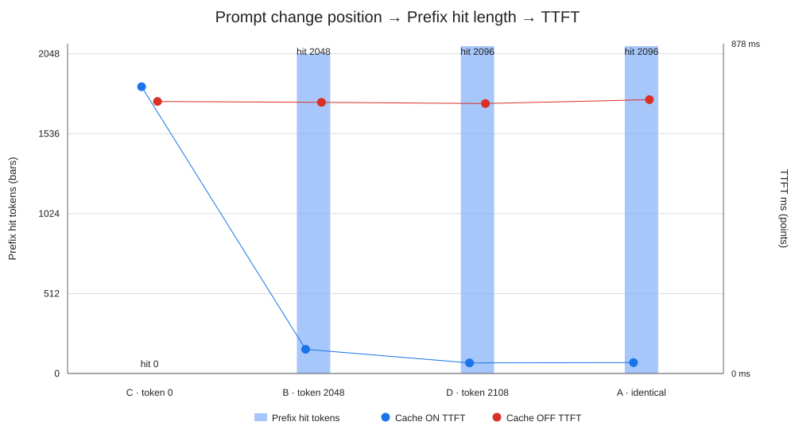

# Topic 3：Automatic Prefix Caching 实验总结

## 1. 目标与结论

本 Topic 研究 KV 如何从单请求私有状态，升级为请求结束后仍可被后续请求复用的
Automatic Prefix Caching（APC）。重点回答：匹配条件与粒度、最长连续前缀、Prompt
修改位置的影响、请求结束后的缓存状态，以及 APC 对 TTFT、TPOT 和吞吐的影响。

结论如下：

1. 复用要求模型侧计算条件一致，且 Prompt 开头存在相同的完整 token blocks；
2. 用户输入按 token 比较，但 vLLM 的 Prefix Cache 以完整 Block 为命中和复用粒度；
3. Block hash 是链式的，任一早期 Block 变化都会使其后所有链式 hash 改变，因此只能
   复用从 Block 0 开始的最长连续前缀；
4. 请求结束时活动引用被解除，`ref_cnt` 可从 1 降到 0，但已提交的完整 Block 仍保留
   hash 和 KV 数据，进入可淘汰缓存，后续请求仍可命中；
5. APC 主要减少 Prefill 计算量和 TTFT。Decode 的每 token 工作没有被省略，因此 TPOT
   基本不变；共享 Prefix 的并发吞吐会因 Prefill 工作量下降而提高。

机制问答见 [`TOPIC_3_FAQ.md`](TOPIC_3_FAQ.md)。

## 2. 分支与实验范围

分支从 `log/paged-kv-block-management` 创建，并合入当时最新的 `upstream/main`
`5e71a11eb`。实验基于合并提交 `35f858a93`，使用真实 Qwen3-1.7B 推理。

基础配置：

| 项目 | 配置 |
| --- | --- |
| 模型 | Qwen/Qwen3-1.7B |
| GPU | NVIDIA RTX 2080 |
| Model runner | V2 |
| KV / model dtype | FP16 |
| Block size | 16 tokens |
| Output | 固定 32 tokens，忽略 EOS |
| Chunked Prefill | 关闭 |
| Async Scheduling | 关闭 |
| Speculative Decoding | 关闭 |
| Max Model Length | 3072 |
| GPU memory utilization | 0.84 |
| KV 容量 | APC off 17088 tokens；APC on 17008 tokens |
| 重复 | 1 次预热 + 5 次计量，报告中取中位数 |

关闭组只关闭跨请求 Prefix Cache；单请求 Prefill/Decode 所需的普通 KV Cache 始终存在。

## 3. Workload 设计

### 3.1 单请求顺序实验

每次 Trial 先清空 Prefix Cache，运行一个 Seed 请求；Seed 结束后，再运行一个 Probe
请求。Seed 和 Probe 都是 2112-token Prompt：2048-token 公共区加 64-token 后缀。

| Case | Probe 相对 Seed 的变化 | 最长公共前缀 |
| --- | --- | ---: |
| A | 完全相同 | 2112 |
| B | 前 2048 相同，64-token 后缀不同 | 2048 |
| C | 第一个 token 不同 | 0 |
| D | 只修改最后 4 tokens | 2108 |

每个 Trial 都先 reset，避免其他 Case 或重复轮次污染缓存；APC 开关两组使用相同的
Prompt、顺序、采样参数和重复次数。

### 3.2 多并发扩展

受 8 GB GPU 容量限制，并发扩展单独使用 1088-token Prompt：1024-token 公共 Prefix
加 64-token 后缀。这样 APC 关闭时，8 个请求也能同时驻留，不会因容量不足被拆成
更小批次。

测试两种 Suite、并发 1/4/8：

- `concurrent_identical`：Seed 后同时提交 N 个完全相同的 Probe；
- `concurrent_shared_prefix`：N 个 Probe 共享前 1024 tokens，但各自后缀不同。

两个 Suite 同样执行 1 次预热和 5 次计量。

## 4. 如何通过结构化日志观察 APC

Topic 1/2 的 Engine 侧 Tracer 被扩展为两个 JSONL 流：

| 流 | 用途 | 关键事件/字段 |
| --- | --- | --- |
| Core | 快速理解时间线与性能 | `REQUEST_ADD`、`PREFIX_LOOKUP`、`SCHEDULE_STEP`、`FIRST_TOKEN`、`FINISH_AFTER_RELEASE`、`REQUEST_SUMMARY` |
| Detail | 验证 Block/hash/ref_cnt | 完整 Prompt SHA256、逐 Block token SHA256、链式 prefix hash、命中/复用/新分配的 Physical Block IDs、释放后缓存状态 |

关键新增记录：

- `PROMPT_HASHES`：完整 token IDs 的 SHA256，以及每个完整 16-token Block 的 token
  SHA256；开启 APC 时还记录 vLLM 实际链式 `prefix_block_hash`；
- `PREFIX_LOOKUP`：开关、查找耗时、命中 tokens/blocks、命中 Physical IDs、增加请求
  引用前的 `ref_cnt`；
- `SCHEDULE_STEP`：本轮 Prefill/Decode、scheduled tokens、复用和新分配 Block IDs、
  Block Table、当前 `ref_cnt` 和 Free Queue；
- `FINISH_AFTER_RELEASE`：释放前后 Free Queue、释放 Block IDs、释放后的 `ref_cnt`、
  `is_cached` 和物理 Block hash；
- `PREFIX_CACHE_RESET`：每个独立 Trial 的缓存边界；
- `REQUEST_SUMMARY`：prefix hit、Prefill 实际 scheduled tokens、TTFT、TPOT 和总耗时。

Tracer 在 `_get_local_prefix_cache_hit` 前后计时，并在 `allocate_slots` 增加引用之前记录
命中 Block 的 `ref_cnt`。因此可以区分“缓存中存在但没有活动请求引用”和“已经被
一个或多个活动请求持有”。

## 5. 单请求结果

### 5.1 命中长度与 Prefill

| Case | APC | LCP | 命中 tokens / blocks | 实际 Prefill tokens | 公共部分被重算 |
| --- | --- | ---: | ---: | ---: | ---: |
| A 完全相同 | off | 2112 | 0 / 0 | 2112 | 2112 |
| A 完全相同 | on | 2112 | 2096 / 131 | 16 | 16 |
| B 公共前缀 | off | 2048 | 0 / 0 | 2112 | 2048 |
| B 公共前缀 | on | 2048 | 2048 / 128 | 64 | 0 |
| C 改首 token | off | 0 | 0 / 0 | 2112 | 0 |
| C 改首 token | on | 0 | 0 / 0 | 2112 | 0 |
| D 改末 4 tokens | off | 2108 | 0 / 0 | 2112 | 2108 |
| D 改末 4 tokens | on | 2108 | 2096 / 131 | 16 | 12 |

三个边界现象：

- vLLM 至少保留一个 token 给当前请求计算。2112-token 完全相同 Prompt 的理论公共
  前缀虽为 2112，最大实际命中为 `floor((2112 - 1) / 16) × 16 = 2096`；
- Case D 的修改发生在最后一个 Block 内。前 131 个完整 Block 命中，最后 12 个未改
  tokens 和 4 个已改 tokens 一起重算，因此实际 Prefill 为 16；
- Case C 改变 Block 0，链式 hash 从起点失配，后面即使 token 内容相同也不能形成
  可独立使用的 Prefix，命中为 0。

### 5.2 TTFT 与 TPOT

| Case | TTFT off | TTFT on | TTFT 变化 | TPOT off | TPOT on |
| --- | ---: | ---: | ---: | ---: | ---: |
| A 完全相同 | 729.05 ms | 28.98 ms | -96.0% | 23.45 ms | 22.29 ms |
| B 公共前缀 | 721.76 ms | 64.29 ms | -91.1% | 23.44 ms | 22.65 ms |
| C 改首 token | 724.17 ms | 763.39 ms | +5.4% | 23.65 ms | 24.11 ms |
| D 改末 4 tokens | 718.67 ms | 28.03 ms | -96.1% | 23.49 ms | 22.99 ms |

命中时 TTFT 随实际 Prefill tokens 显著下降；没有命中的 Case C 没有收益，约 5% 的
差值属于独立 Engine 运行、Trace 和系统抖动，不能解释为 APC 稳定降低或提高了
Decode 性能。四组 TPOT 很接近，符合“Prefix Cache 省 Prefill，不省 Decode”的预期。

产出图：



## 6. 一条原始 Trace 的解读

Case A 第一条计量 Probe `9-b4067a59`：

```text
REQUEST_ADD
  prompt=2112, prefix_cache_enabled=true

PROMPT_HASHES
  132 个完整 token blocks；Seed/Probe 的逐 Block token SHA256 全相同

PREFIX_LOOKUP
  hit=2096 tokens=131 blocks
  复用前这些 Block 的 ref_cnt 全为 0

第一个 SCHEDULE_STEP（PREFILL）
  reused=131 blocks
  newly allocated=1 block
  scheduled=16 tokens

FIRST_TOKEN / REQUEST_SUMMARY
  TTFT=28.12 ms, TPOT=22.20 ms

FINISH_AFTER_RELEASE
  请求引用解除；完整且已提交的 Blocks ref_cnt=0、cached=true
  尾部未完整/不可缓存 Block cached=false
```

这里 `ref_cnt=0` 与 `cached=true` 同时成立，是“请求结束后仍能被下一请求命中”的
直接证据。缓存 Block 仍在 Block Pool 和 Free Queue/LRU 中，不再属于 Seed 请求；
Probe 命中后，复用操作再把活动引用从 0 增加为 1。

## 7. 为什么只能命中最长连续 Prefix

可将链式 hash 简化为：

```text
H0 = hash(tokens[0:16], extra_keys)
H1 = hash(H0, tokens[16:32], extra_keys)
H2 = hash(H1, tokens[32:48], extra_keys)
...
```

Block `i` 的身份依赖 Block `0…i` 的全部前缀。修改第一个 token 会改变 `H0`，进而
改变所有后续 hash；修改最后 4 tokens 只影响最后一个 Block，前 131 个链式 hash
仍相同。这也避免把“中间相同的一段 KV”错误地放到不同历史上下文中复用。

## 8. 多并发结果

### 8.1 Prefix hit 与 TTFT

| Suite | 并发 | 命中 tokens | Prefill tokens | TTFT off | TTFT on |
| --- | ---: | ---: | ---: | ---: | ---: |
| 完全相同 | 1 | 1072 | 16 | 256.07 ms | 23.17 ms |
| 完全相同 | 4 | 1072 | 16 | 994.78 ms | 44.41 ms |
| 完全相同 | 8 | 1072 | 16 | 2007.40 ms | 68.71 ms |
| 共享 1024 Prefix | 1 | 1024 | 64 | 262.27 ms | 41.38 ms |
| 共享 1024 Prefix | 4 | 1024 | 64 | 994.25 ms | 106.91 ms |
| 共享 1024 Prefix | 8 | 1024 | 64 | 1770.04 ms | 213.42 ms |

表中 APC-off 的命中均为 0、Prefill 均为 1088；为简洁没有重复列出。TTFT 是该组
所有 Probe 的中位数。并发增加后 TPOT 仍主要由共享 GPU 的 Decode batch 决定；APC
最大的变化仍发生在第一个 token 之前。

### 8.2 吞吐

| Suite | 并发 | Requests/s off | Requests/s on | 加速 |
| --- | ---: | ---: | ---: | ---: |
| 完全相同 | 1 | 1.02 | 1.37 | 1.35× |
| 完全相同 | 4 | 2.25 | 5.01 | 2.23× |
| 完全相同 | 8 | 2.57 | 7.04 | 2.73× |
| 共享 1024 Prefix | 1 | 1.01 | 1.33 | 1.31× |
| 共享 1024 Prefix | 4 | 2.26 | 4.30 | 1.91× |
| 共享 1024 Prefix | 8 | 2.61 | 6.13 | 2.35× |

并发 8、完全相同的一条计量 Trace 中，8 个 Probe 都复用同一组 67 个 Blocks。调度器
按请求顺序处理 Prefix lookup 时，首个共享 Block 的 `ref_cnt_before_touch` 依次为
`0,1,2,3,4,5,6,7`，证明并发请求共享的是相同 Physical Blocks，而不是复制 8 份。

## 9. 缓存保留、释放与驱逐

APC 没有建立第二份独立 KV 内存：可缓存 Block 与普通运行时 Block 共用 Block Pool。

```text
Seed Finish
  请求 ref_cnt: 1 → 0
  完整 Block: hash/KV 保留，cached=true，进入可淘汰队列
  尾部未提交 Block: cached=false，可直接重用

后续 Probe 命中
  从 hash → Physical Block 映射找到缓存页
  ref_cnt: 0 → 1

空间不足
  优先重用/驱逐 ref_cnt=0 的可淘汰 Block
  清除旧 hash 映射，Physical Block 分配给新内容
```

此外，显式 `reset_prefix_cache` 或 Engine 退出也会清空缓存。`ref_cnt>0` 的活动共享页
不能被驱逐；`ref_cnt=0` 表示可以驱逐，不表示数据已立即擦除。

## 10. 自动校验与测试

分析器对每个计量 Probe 执行：

```text
prefix_hit_tokens <= longest_common_prefix_tokens
APC on  → prefix_hit_tokens % 16 == 0
APC off → prefix_hit_tokens == 0
prefill_tokens_scheduled == prompt_tokens - prefix_hit_tokens
```

全部 300 个计量 Probe（每种 APC 模式 150 个）通过，分析结果中的
`all_invariants_passed=true`。

新增 Scheduler 单测覆盖：

- 顺序 Seed → Probe 的 Block hash 命中、`ref_cnt 0→1`、复用/分配分类和释放后缓存；
- 3 个并发 Probe 共享同一 Physical Block，lookup 前 `ref_cnt` 依次为 0/1/2。

最终验收：

- `-k kv_lifecycle_trace`：10 passed；
- 完整 `tests/v1/core/test_scheduler.py`：162 passed，1 个双 GPU pipeline-parallel
  用例因本机只有 1 张 GPU 未运行；
- 5 个改动/新增 Python 文件通过 Ruff check、Ruff format check 和 `py_compile`；
- 两份压缩 Detail Trace 通过 `gzip -t`，分析器也验证了压缩日志读取路径。

## 11. 复现与产物

```bash
HF_HOME=$PWD/.hf_cache \
HF_HUB_OFFLINE=1 \
TRANSFORMERS_OFFLINE=1 \
VLLM_CACHE_ROOT=$PWD/tmp/vllm-cache \
.venv/bin/python examples/basic/offline_inference/automatic_prefix_caching.py \
  --model Qwen/Qwen3-1.7B \
  --trace-dir output/automatic_prefix_caching_qwen3_1_7b/off \
  --prefix-cache off

# 将 off 改为 on，并设置 --prefix-cache on 后运行开启组。

.venv/bin/python \
  examples/basic/offline_inference/analyze_automatic_prefix_caching.py \
  output/automatic_prefix_caching_qwen3_1_7b
```

产物目录包含：

- `analysis_summary.json`：逐请求数据、中位数与吞吐聚合；
- `experiment_manifest.json`：完整 Trial、Prompt hash 和 client 侧 batch 耗时；
- `kv_lifecycle_core_*.jsonl`：可直接阅读的核心时间线；
- `kv_lifecycle_detail_*.jsonl.gz`：压缩后的完整 Block/hash/ref_cnt Trace；
- `prompt_change_prefix_hit_ttft.svg`：要求的关系图。

绝对延迟包含 eager 模式和详细 Trace 的额外开销，适合解释机制和同机相对比较，不应
直接作为无 Trace 的生产性能基准。
